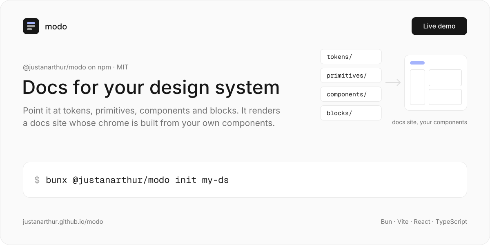
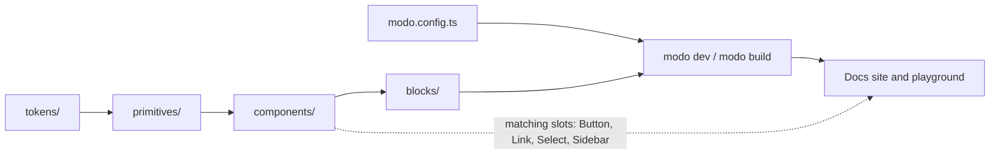

<a href="https://justanarthur.github.io/modo/"></a>

# modo

a lightweight CLI that renders a **docs site / playground for your design system**. zero config: the lib enforces a simple folder structure (`tokens/ → primitives/ → components/ → blocks/`), discovers it, and produces the site — including **shell inheritance**: when your components match the docs chrome's slots (Button, Link, Select, Sidebar…), the chrome itself renders with *your* components. one Sidebar drives both the left nav and the right panel.

**live demo: https://justanarthur.github.io/modo/** — every design system below, switchable from the panel.

```bash
bunx @justanarthur/modo init my-ds
```

proven against real-world design systems — see `demo/design-systems/` and `ui/`:

- **filled** — minimal reference DS
- **shadcn/ui** — pulled with the real shadcn CLI (Tailwind v4), reorganized into modo structure
- **fluid-functionalism** — the `@fluid` registry layer (motion springs, fluid hover) on its own shadcn foundation
- **ui** — Fluid Functionalism (Base UI) on UnoCSS: springs, fluid hover, size ladder, surface elevation, plus a morph layer (overlays grow out of their trigger, indicators melt between items). Published as [`@justanarthur/modo-ui`](./ui#install). it ships its design language as [`DESIGN.md`](ui/DESIGN.md), an agent guide in [`AGENTS.md`](ui/AGENTS.md) with the [`modo-ui` skill](.claude/skills/modo-ui/SKILL.md), and a Craft page of bad / good pairs
- **MUI** — adapters over `@mui/material`, default theme extracted into token files

## getting started

modo is published as [`@justanarthur/modo`](https://www.npmjs.com/package/@justanarthur/modo). scaffold a new design-system workspace and run it:

```bash
# with bun (recommended)
bunx @justanarthur/modo init my-ds
cd my-ds && bun install
bun dev          # docs site at a local port (modo dev / modo build / modo check)

# with npm/pnpm it works the same
npx @justanarthur/modo init my-ds
cd my-ds && npm install && npm run dev
```

`modo init` creates a self-contained workspace with **zero lib files you need to touch** — modo owns its own internal Vite app; your project only contains the design system:

```
my-ds/
├── modo.config.ts          — site config (name, css, vite, shell, panel)
├── global.css              — your global styles and chrome restyling
├── package.json            — depends on @justanarthur/modo, react, react-dom
├── tsconfig.json
├── tokens/                 — design tokens as plain CSS custom properties
│   └── colors.css, radius.css, spacing.css, typography.css
├── primitives/             — tier 1: atoms (Button, Surface, …)
│   └── button/
│       ├── index.tsx       — the item: default export + TSDoc contract
│       ├── examples.mdx    — its live examples
│       └── button.css      — co-located CSS is auto-injected
├── components/             — tier 2: composites (Dialog, Select, …)
└── blocks/                 — tier 3: page-level patterns
```

`tokens/`, `primitives/`, `components/`, `blocks/` are auto-discovered by directory. any of them can be omitted; tiers render in that order. add more later with `bunx modo add primitive my-thing` (or `component`, `block`, `token`); it writes `index.tsx` and `examples.mdx` from `lib/templates/stubs`.

## how it works

modo discovers the tiers by directory, reads each item's TSDoc contract and its `examples.mdx`, and renders everything in its own internal Vite app. the docs chrome is matched slot by slot against your components, so the site is styled by the design system it documents.



## authoring items

an item is a default-exported function in `<tier>/<name>/index.tsx` whose TSDoc is the docs contract, with its examples beside it:

```tsx
/**
 * Button — the primary interaction primitive.
 *
 * @example {@include ./examples.mdx}
 */
export default function Button({ variant = 'primary', children }: {
  /** Visual style. */
  variant?: 'primary' | 'secondary'
  /** Button content. */
  children?: React.ReactNode
}) { … }
```

```mdx
# Primary

<Button>Click me</Button>
```

- **name / description** — from the TSDoc block right above the default export's declaration (plain `function` or `forwardRef` const both work).
- **props** — extracted from the destructured params + inline type literal (or a same-file interface/type alias), with per-prop JSDoc (`@default`, `@values`). rendered as the item's prop table and used for shell slot matching.
- **examples** — `examples.mdx` holds `# Title` + a JSX block per example; it goes through the same build as your items, so imports are real and providers are shared. a short inline `@example` (`# Title` and a ` ```tsx ` fence) also works; that one compiles in the browser with items bound by name.
- **compound items** — attach sub-components as static attributes on the default export (`Card.Header = …`); `<Card.Header>` works in examples too.
- **CSS** — any `.css` file co-located in the item dir is injected automatically.

tokens are plain CSS, one file per group (`colors.css`, `typography.css`, `spacing.css`, `radius.css`, `motion.css`) — or a single file using var prefixes (`--space-*`, `--motion-*`, …). the tokens page renders each group as swatches.

## integrating into your project (`modo.config.ts`)

```ts
import { defineConfig } from '@justanarthur/modo/config'

export default defineConfig({
  name: 'my-ds',
  description: 'My design system',

  // global stylesheet, injected right after the lib's structural CSS
  // (before your items' CSS) — the canonical place for resets, fonts, base rules
  css: './global.css',

  // extend modo's internal Vite config — e.g. Tailwind:
  // vite: './vite.config.extend.ts'   // default export: (config) => newConfig
  // (that module is imported natively, never bundled)

  // pin docs-chrome slots to your components explicitly
  // (otherwise slots are matched by name + required props, see below)
  shell: {
    Button: 'primitives/button',
    Link: 'primitives/link',
    Select: 'components/select',
    Sidebar: 'components/sidebar',
    Code: 'primitives/code',
    Icon: './modo.components.tsx#Icon', // a path may name an export
  },

  // entries rendered in the right panel, each as a Sidebar.Section
  panel: {
    items: [
      { label: 'Colors', component: 'blocks/color-palette' },
    ],
  },
})
```

### shell inheritance

the docs chrome looks for your components per slot (`Button`, `Link`, `Code`, `Icon` in primitives; `Select`, `Sidebar Root/Item/Section` in components) matched by parsed name + required props — `children` must be visible in the parsed type (`href` for `Link`). unmatched slots fall back to the lib's structural Plain components. to style the chrome itself, target the `data-modo` attributes (`data-modo="sidebar"`, `"example-card"`, `"swatch"`, …) from your `css` — the lib ships structure, you ship the look.

## what the lib ships

- discovery + parsing: `tokens/*.css` (file-per-group or var prefixes), `<tier>/<name>/index.tsx` items with TSDoc-extracted name/description/props, and their live examples from `examples.mdx`
- the docs site chrome (sidebar / content / panel / example cards / prop tables / foundation pages) as **structural CSS only** — every visual reads your tokens; the chrome brings only its own labels
- shell inheritance with graceful Plain fallbacks for unmatched slots
- user hooks: `modo.config.ts` → `css` (global stylesheet), `vite` (extend the internal Vite config — e.g. add `@tailwindcss/vite`), `shell` (pin slots explicitly), `panel`, `examples` (names in scope in every example)

## structure

```
modo/
├── lib/                          — the npm package `@justanarthur/modo` (bin `modo`)
│   ├── src/runtime/              — internal renderer (plain Vite SPA) + structural CSS
│   ├── src/plugins/              — Vite plugins: the shared item build, tokens, shell
│   ├── src/lib/                  — schemas, TSDoc parser, token/css parsing, slot matching
│   ├── templates/                — `modo init` scaffold and `modo add` stubs
│   └── test/                     — parser tests
├── ui/                           — the npm package `@justanarthur/modo-ui`, documented with modo
├── demo/                         — harness: multi-DS runner + demo-switcher
│   └── design-systems/<name>/    — one workspace package per design system showcase
└── package.json
```

## develop

```bash
git clone https://github.com/justAnArthur/modo && cd modo
bun install

# run all design-system showcases (one dev server each + switcher, ports 5173+i); builds the lib's CLI first if needed
bun dev            # from repo root (or: cd demo && bun dev)

# a single showcase
cd demo && bun dev shadcn

# what CI runs
bun run lint
bun run build && bun run check
bun run test
```

## releases

Published to **npmjs.com only** (the package name `modo` is taken on npmjs.com by another user; this repo publishes under the `@justanarthur/modo` scope).

The bump + publish + release pipeline is driven by [`just-github-actions-n-workflows`](https://github.com/justAnArthur/just-github-actions-n-workflows) (`v1.0.3`, stock workflows installed via the toolkit CLI).

### Required secret on the GitHub repo

- `NPM_TOKEN` — npm automation token (publishes to npmjs.com).

### Pipeline

1. Conventional commit to `main` → `bump-version.yml` reads the scope (`lib`, `modo`, `justanarthur`, `@justanarthur/modo` or `justanarthur/modo`), bumps `lib/package.json`, creates annotated tag `@justanarthur/modo@<version>` with JSON `{"deployTargets":["npm"]}`, pushes the tag, then dispatches the tag workflows for it (a push made with `GITHUB_TOKEN` starts no workflows on its own).
2. Dispatch, or a tag pushed by hand → `publish-npm-on-tag.yml` resolves metadata, installs deps, builds, runs `bun publish -p --access public --tag <dist-tag>` to npmjs.com.
3. `publish-npm-on-tag.yml` creates the GitHub Release with conventional-commit notes. `release-on-tag.yml` runs for the same tag too; whichever finishes second finds the release already there.

### Local publish

```sh
cd lib
NPM_CONFIG_TOKEN=… bun publish -p --access public
```

## license

[MIT](LICENSE)
